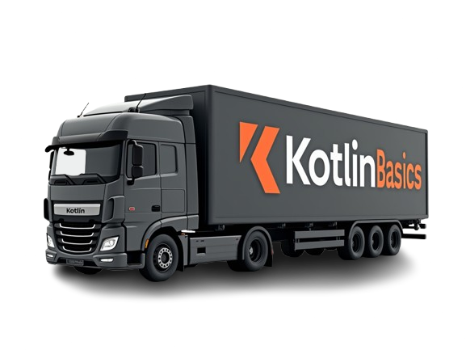

# Logistik Management System
> Ein Projekt um seine Kotlin Basic fähigkeiten zu festigen.

    

Entwickle ein Logistik-Management-System als Kotlin-Konsolenanwendung.

## Projektziele:
- Praktische Anwendung der Kotlin-Programmierkonzepte
- Entwicklung einer erweiterbaren, objektorientierten Architektur
- Implementierung eines praxisnahen Logistik-Systems

## Funktionale Anforderungen:
- ### Fahrzeugverwaltung
  - Implementierung verschiedener Fahrzeugtypen
  - Verwaltung von Fahrzeugzuständen (verfügbar, wartung, besetzt)
  - Wartungsplanung und -überwachung
  - Eigenschaften wie Kraftstoffart, maximale Zuladung
- ### Fahrerverwaltung
  - Verwaltung von Fahrerstatus
  - Führerscheinverwaltung mit Gültigkeitsprüfung
  - Urlaubsplanung
- ### Auftragsverwaltung
  - Verwaltung von Lieferaufträgen
  - Zuordnung zu Fahrzeugen unter Berücksichtigung der Kapazität
  - Warenverwaltung mit Gewicht und Menge 

## Technische Anforderungen:
- Nutzung von Interfaces und abstrakten Klassen
- Implementierung von Datenklassen
- Verwendung von Nullable Types
- Implementierung von Extension Functions
- Nutzung von Higher-Order Functions
- Verwendung von Generics wo sinnvoll
- Strukturierte Package-Organisation

## Projektaufgaben für den Azubi:
- ### Erstelle ein Konzeptdokument mit:
  - UML-Klassendiagramm
  - Package-Struktur
  - Beschreibung der geplanten Klassen und Interfaces
- ### Plane die Datenmodelle für:
  - Verschiedene Fahrzeugtypen
  - Fahrer und deren Status
  - Aufträge und Waren
- ### Entwickle ein Konzept für:
  - Benutzerinteraktion über die Konsole
  - Datenverwaltung und -speicherung 
  - Fehlerbehandlung 
- ### Dokumentiere deine Überlegungen zu:
  - Erweiterbarkeit des Systems 
  - Wartbarkeit des Codes 
  - Testbarkeit der Komponenten 

Das fertige Programm soll über die Konsole bedienbar sein und alle CRUD-Operationen für Fahrzeuge, Fahrer und Aufträge unterstützen.